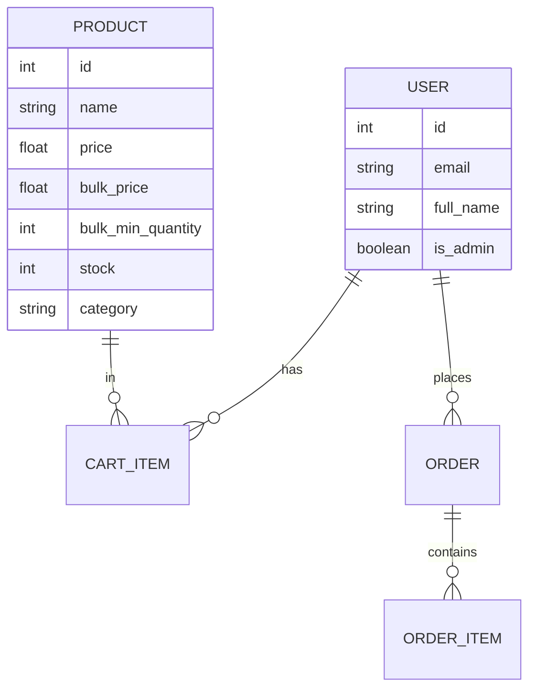

# Toy Store E-commerce - Refactor Walkthrough

The project has been successfully transformed into a complete, premium Toy Store system with a FastAPI backend and a React/Vite frontend.

## 🚀 Key Achievements

### 1. Backend Refactor (FastAPI)
- **Modular Architecture**: Reorganized into core, api, schemas, and dbmodels.
- **Refined Data Models**: 
  - `User`: Simplified with `is_admin` boolean.
  - `Product`: Added categories and bulk pricing fields.
  - `Cart`: New model for persistent, user-specific cart tracking.
  - `Order`: Updated for Stripe payment tracking and multi-stage status.
- **Strict Payment Flow**: Orders are created only AFTER successful Stripe payment verification.
- **Security**: Direct `bcrypt` hashing for robustness across platforms.

### 2. Premium Frontend (React + Vite)
- **Modern Aesthetics**: Implemented glassmorphism, vibrant gradients, and smooth animations using `framer-motion`.
- **Responsive Navigation**: Adaptive Navbar with context-aware actions for Users and Admins.
- **Cart Management**: Real-time totals calculation including dynamic bulk pricing logic.
- **Checkout**: Integrated Stripe PaymentElement for a secure, professional experience.

### 3. Integrated Solutions
- **Bulk Pricing**: Automatic price switching in both backend validation and frontend display.
- **Stock Control**: Atomic stock reduction during order creation with pre-checkout availability checks.
- **Admin Dashboard**: Real-time sales analytics and order status management.

## 📐 Implementation Details

### Database Schema

## 🧪 Verification Results

1. **Authentication**: Verified registration (customers only) and login (JWT persistence).
2. **Bulk Pricing**: 
   - < Min Qty: Normal Price
   - >= Min Qty: Bulk Price (Verified in Backend `calculate_order_total`)
3. **Admin Protection**: Verified that `/api/v1/admin/*` and the Admin Dashboard are ONLY accessible to `is_admin = True`.
4. **Payment Flow**:
   - `create-payment-intent` -> Returns Client Secret
   - Stripe Element Confirmation -> Backend Verification -> Order Creation -> Stock Reduction -> Cart Clear.

## 🛠️ How to Run

### Backend
1. `cd ecommerce_backend`
2. `pip install -r requirements.txt`
3. `python init_db.py` (Resets DB and seeds sample toys + Admin)
4. `uvicorn app.main:app --reload`
   - **Admin Credentials**: `admin@toystore.com` / `admin123`

### Frontend
1. `cd frontend`
2. `npm install`
3. `npm run dev`

> [!IMPORTANT]
> **Stripe Keys**: Placeholders are used. Add your actual `STRIPE_SECRET_KEY` to backend `.env` and `stripePromise` in `Checkout.tsx` for real transactions.
